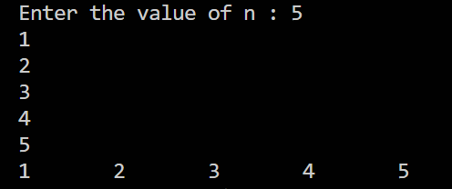
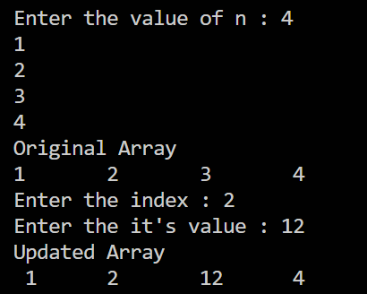
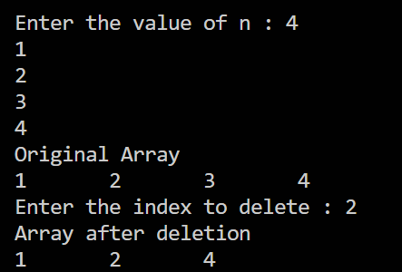
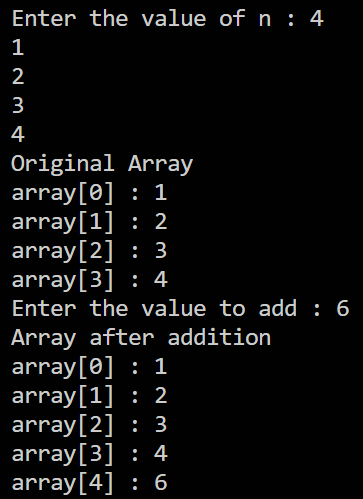
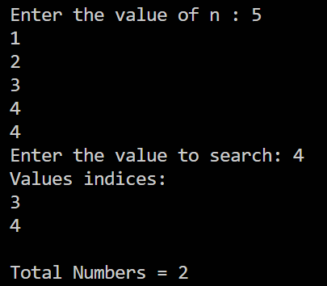
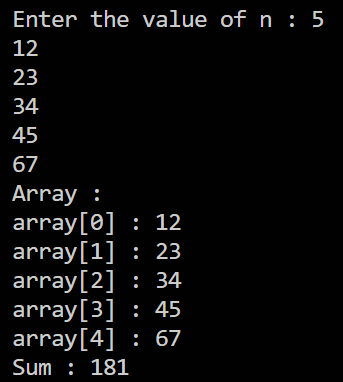
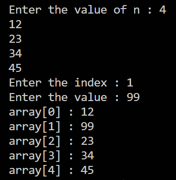
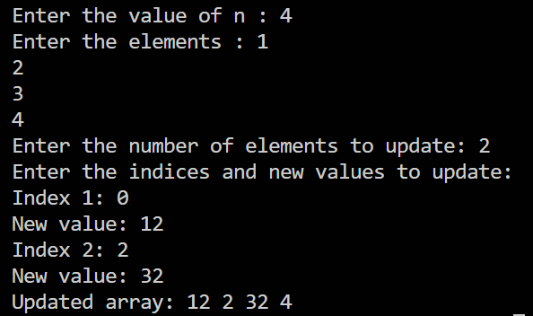
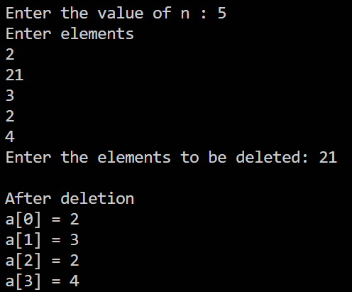
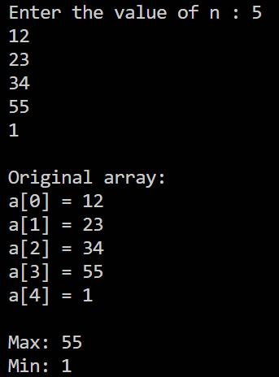

## Output for q1.c

## Output for q2.c

## Output for q3.c

## Output for q4.c

## Output for q5.c

## Output for q6.c

## Output for q7.c

## Output for q8.c

## Output for q9.c

## Output for q10.c
